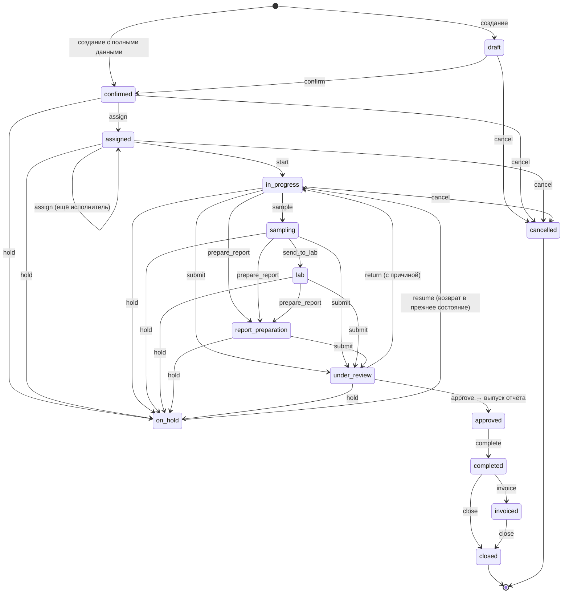
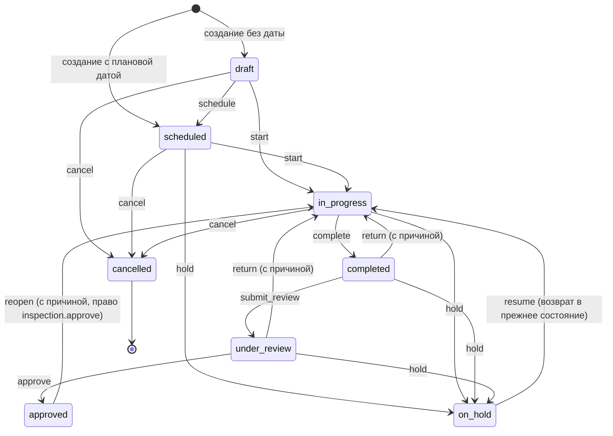

# Рабочие процессы GSI ONE

Документ описывает жизненные циклы сущностей и правила переходов. Актуально с PHASE 4.

---

## Заявка (Job)

Заявка — центральная операционная сущность: через неё связаны клиент, контракт, исполнители, чек-лист, отчёт и финансы.

### Состояния



### Действия, права и обязательная причина

| Действие | Из | В | Право | Причина обязательна | Проверки |
|---|---|---|---|---|---|
| `confirm` | draft | confirmed | `job.change_status` | — | клиент, офис, тип услуги, запрошенная дата |
| `assign` | confirmed, assigned | assigned | `job.assign` | — | есть хотя бы один исполнитель |
| `start` | assigned | in_progress | `job.start` | — | — |
| `sample` | in_progress | sampling | `job.change_status` | — | — |
| `send_to_lab` | sampling | lab | `job.change_status` | — | — |
| `prepare_report` | in_progress, sampling, lab | report_preparation | `job.change_status` | — | — |
| `submit` | in_progress, sampling, lab, report_preparation | under_review | `job.submit` | — | чек-лист заполнен полностью |
| `return` | under_review | in_progress | `job.cancel` | **да** | — |
| `approve` | under_review | approved | `job.approve` | — | в той же транзакции выпускается отчёт |
| `complete` | approved | completed | `job.change_status` | — | есть выпущенный отчёт |
| `invoice` | completed | invoiced | `job.change_status` | — | — |
| `close` | completed, invoiced | closed | `job.close` | — | нет неоплаченных счетов |
| `hold` | все активные | on_hold | `job.change_status` | **да** | — |
| `resume` | on_hold | предыдущее состояние | `job.change_status` | — | — |
| `cancel` | draft … report_preparation, on_hold | cancelled | `job.cancel` | **да** | — |

Терминальные состояния: `closed`, `cancelled`. Повторное открытие не предусмотрено; если понадобится — это отдельное право и отдельный переход, а не редактирование статуса.

### Почему «под проверкой» называется `under_review`

Значение существует с MVP-1, печатается и переводится. Переименование в `review` ничего не улучшает, но затрагивает данные, переводы и код — поэтому осталось как есть. В терминах ТЗ `under_review` = REVIEW.

Значение `new` из старой модели переименовано в `confirmed` (миграция 012): заявка в прежней модели уже была полной, ей не хватало только исполнителя. Переименование значения enum не переписывает строки — все 956 существующих заявок перешли в новый словарь без единого UPDATE.

### Движок

Ни один эндпоинт не пишет `status` напрямую. Единственный вход — `JobWorkflowService.apply()`, и он всегда делает одно и то же:

```
проверить право → проверить допустимость перехода → проверить причину →
проверить бизнес-правила → обновить строку → записать историю →
записать аудит → отправить событие
```

Всё это внутри одной транзакции вызывающего кода: заявки со статусом, которого нет в истории, существовать не может.

События (`JobEventsService`) — это шов для уведомлений PHASE 10: `job.status_changed`, `job.assigned`, `job.unassigned`.

### Исполнители

Заявку ведёт команда, а не один инспектор:

| Роль назначения | Смысл |
|---|---|
| `lead_inspector` | ведущий; дублируется в `assigned_inspector_id` для отчёта и области видимости «свои» |
| `inspector` | инспектор |
| `sampler` | пробоотборщик |
| `lab_coordinator` | координатор лаборатории |
| `report_reviewer` | проверяющий отчёт |
| `operations_coordinator` | координатор операций |

Ведущий на заявке один — это гарантирует частичный уникальный индекс. Снятие исполнителя не удаляет строку, а проставляет `removed_at`: «кто работал на этой заявке в марте» остаётся вопросом с ответом.

Проверки при назначении: сотрудник активен и работает в офисе, отвечающем за заявку. Назначение и снятие пишутся в аудит.

### Просрочка

Просрочка не хранится: это `scheduled_at < now()` при активном статусе. Статус `overdue` был бы третьим источником правды и рассинхронизировался бы в первый же день.

### Архив против отмены

- `cancelled` — бизнес-исход: работа не состоялась, заявка видна.
- `deleted_at` (архив) — жизненный цикл хранения: заявка скрыта из списков, восстанавливается по праву `job.restore`.

Архивировать можно только заявку, которая не начиналась (`draft`, `confirmed`) или уже отменена. Всё остальное сначала отменяется.

### Конкурентное редактирование

У заявки есть `version`, увеличиваемая триггером при каждом изменении. Форма присылает версию, с которой её открыли; если в базе новее — изменение отклоняется с 409 и понятным сообщением, а не затирает чужую правку.

---

## Инспекция (Inspection)

Инспекция — полевая работа по заявке. Одна заявка может держать несколько инспекций: погрузка и выгрузка, повторная инспекция после устранения замечания, разные виды услуг по одной номинации. Поэтому чек-лист, фотографии, замечания и замеры принадлежат инспекции, а не заявке.

### Состояния



Состояния `READY` нет намеренно: это был бы клик без решения за ним. Инспекция запланирована — и затем начата.

### Действия, права и обязательная причина

| Действие | Из | В | Право | Причина обязательна | Проверки |
|---|---|---|---|---|---|
| `schedule` | draft | scheduled | `inspection.update` | — | есть плановая дата начала |
| `start` | scheduled, draft | in_progress | `inspection.start` | — | исполнитель с областью «свои» должен быть назначен на инспекцию |
| `complete` | in_progress | completed | `inspection.complete` | — | все обязательные пункты чек-листа отвечены |
| `submit_review` | completed | under_review | `inspection.complete` | — | — |
| `return` | under_review, completed | in_progress | `inspection.review` | **да** | причина сохраняется в `review_comment` и видна инспектору |
| `approve` | under_review | approved | `inspection.approve` | — | фиксируются `reviewed_by` и `reviewed_at` |
| `reopen` | approved | in_progress | `inspection.approve` | **да** | единственный выход из утверждённой инспекции |
| `hold` | scheduled, in_progress, completed, under_review | on_hold | `inspection.cancel` | **да** | — |
| `resume` | on_hold | предыдущее состояние | `inspection.cancel` | — | — |
| `cancel` | draft, scheduled, in_progress, on_hold | cancelled | `inspection.cancel` | **да** | — |

Сдать работу — действие самого инспектора (`inspection.complete`), а `inspection.review` — право судить о работе, а не сдавать её.

### Защита от тихого изменения

Редактировать данные инспекции, чек-лист, замечания, замеры и фотографии можно только в `draft`, `scheduled`, `in_progress`. После `complete` экран становится read-only, а попытка записи возвращает 409 с объяснением.

Утверждённую инспекцию изменить нельзя вовсе — только `reopen` с письменной причиной, которая попадает и в историю, и в аудит. Исключение одно: статус замечания (`open → acknowledged → resolved → withdrawn`) меняется и после утверждения — это работа по следам инспекции, а не переписывание самой инспекции. Текст замечания при этом заморожен вместе с остальными доказательствами.

Тот же запрет действует и со стороны заявки: пункт чек-листа, принадлежащий инспекции, подчиняется её блокировке, даже если открыть его через старый эндпоинт заявки.

### Связь с заявкой

Единственная автоматическая связь: первая начатая инспекция переводит назначенную заявку в работу — и только через `JobWorkflowService`, со своей записью в истории заявки. Обратного автоматизма нет: заявка с тремя инспекциями не закончена оттого, что закончена одна из них.

Создание заявки открывает её первую инспекцию — ту, что несёт чек-лист. Остальные добавляются вручную на карточке заявки, вкладка «Инспекции».

### Чек-лист

Пункты — снимок шаблона на момент создания инспекции: подпись, тип поля, секция, обязательность и версия шаблона копируются в строку. Правка шаблона в следующем году не меняет того, что спрашивали в прошлом (ISO 17020). Версия шаблона хранится в `template_version`; строки, снятые до PHASE 4, так и остаются `v1-draft`.

Обязательность (`is_required`) по умолчанию `true` — ровно то, чего и раньше требовал процесс заявки. Шаблон помечает необязательными только те пункты, которых на объекте может не быть вовсе (сертификат калибровки весов при драфт-сюрвее, экспресс-тест влажности).

### Автосохранение в поле

Полевой экран копит правки и отправляет их пачкой одним запросом через 800 мс после последнего действия, а также при уходе со страницы и при сворачивании приложения. Состояние показывается честно: «Сохранение…», «Сохранено», «Не сохранено» с кнопкой повтора. Неудачное сохранение не теряет правки — они остаются в очереди.

Первый ответ или первая фотография по запланированной инспекции начинают её автоматически — инспектор явно на объекте. Переход идёт через тот же движок, поэтому в истории он выглядит как обычный `start` с пометкой `auto`.

### Замечания, замеры, фотографии

- **Замечания** (`inspection_findings`) — то, на что кто-то должен отреагировать: важность `info | minor | major | critical`, статус `open | acknowledged | resolved | withdrawn`. Отмеченные `is_internal` не попадают ни в один документ для клиента.
- **Замеры** (`inspection_measurements`) — одна расширяемая таблица вместо колонки на каждую величину: тип, числовое и/или текстовое значение, единица, место замера.
- **Фотографии** — те же `media_attachments`, что и раньше, с добавленными `inspection_id`, категорией и подписью. Оригинал хранится байт в байт, sha256 позволяет аудитору проверить целостность, GPS и время съёмки приходят с устройства.

### Движок

Как и у заявки: `InspectionWorkflowService.apply()` — единственный, кто пишет `status`, и делает это всегда одинаково:

```
проверить право → проверить допустимость перехода → проверить причину →
проверить бизнес-правила → обновить строку → записать историю →
записать аудит → отправить событие
```

### Архив против отмены

`cancelled` — бизнес-исход, инспекция видна. `deleted_at` — архив, инспекция скрыта из списков и восстанавливается по праву `inspection.restore`. Архивировать можно только инспекцию, которая не начиналась (`draft`, `scheduled`) или уже отменена.

### Конкурентное редактирование

У инспекции есть `version`, увеличиваемая триггером. Форма присылает версию, с которой её открыли; если в базе новее — 409 с понятным сообщением вместо тихой перезаписи чужой правки.

---

## Отчёт

`draft → issued → revoked`. Выпуск происходит только при утверждении заявки (`approve`), в той же транзакции. Отчёт с QR проверяется публично по токену без авторизации.

Версионирование отчётов (новая ревизия вместо тихого изменения) — PHASE 7.

## Счёт

`draft → issued → partially_paid → paid`, плюс `cancelled`. Отмена не удаляет проводки, а сторнирует их. Детали — в `docs/03-finance-dashboard.md`.

## Контракт

`draft → active → suspended / expired / terminated`. Статус меняется вручную; срок действия контролируется отдельно (`valid_to`), и экран контрактов показывает истекающие.
