# Рабочие процессы GSI ONE

Документ описывает жизненные циклы сущностей и правила переходов. Актуально с PHASE 8.

---

## Заявка (Job)

Заявка — центральная операционная сущность: через неё связаны клиент, контракт, исполнители, чек-лист, отчёт и финансы.

### Состояния

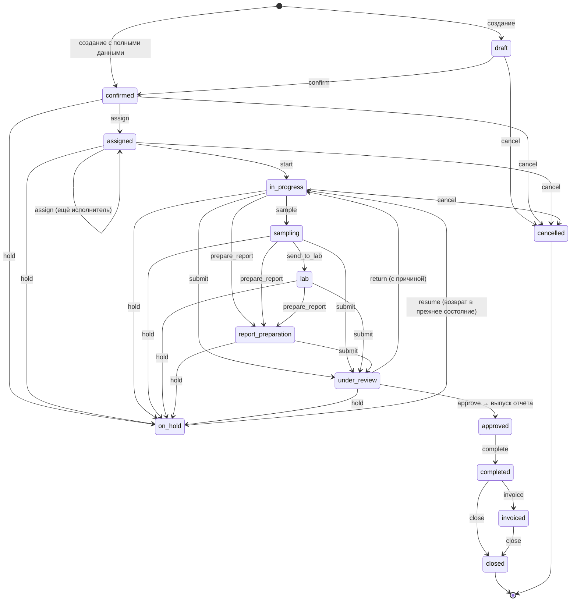

### Действия, права и обязательная причина

| Действие | Из | В | Право | Причина обязательна | Проверки |
|---|---|---|---|---|---|
| `confirm` | draft | confirmed | `job.change_status` | — | клиент, офис, тип услуги, запрошенная дата |
| `assign` | confirmed, assigned | assigned | `job.assign` | — | есть хотя бы один исполнитель |
| `start` | assigned | in_progress | `job.start` | — | — |
| `sample` | in_progress | sampling | `job.change_status` | — | — |
| `send_to_lab` | sampling | lab | `job.change_status` | — | — |
| `prepare_report` | in_progress, sampling, lab | report_preparation | `job.change_status` | — | — |
| `submit` | in_progress, sampling, lab, report_preparation | under_review | `job.submit` | — | чек-лист заполнен полностью |
| `return` | under_review | in_progress | `job.cancel` | **да** | — |
| `approve` | under_review | approved | `job.approve` | — | в той же транзакции выпускается отчёт |
| `complete` | approved | completed | `job.change_status` | — | есть выпущенный отчёт |
| `invoice` | completed | invoiced | `job.change_status` | — | — |
| `close` | completed, invoiced | closed | `job.close` | — | нет неоплаченных счетов |
| `hold` | все активные | on_hold | `job.change_status` | **да** | — |
| `resume` | on_hold | предыдущее состояние | `job.change_status` | — | — |
| `cancel` | draft … report_preparation, on_hold | cancelled | `job.cancel` | **да** | — |

Терминальные состояния: `closed`, `cancelled`. Повторное открытие не предусмотрено; если понадобится — это отдельное право и отдельный переход, а не редактирование статуса.

### Почему «под проверкой» называется `under_review`

Значение существует с MVP-1, печатается и переводится. Переименование в `review` ничего не улучшает, но затрагивает данные, переводы и код — поэтому осталось как есть. В терминах ТЗ `under_review` = REVIEW.

Значение `new` из старой модели переименовано в `confirmed` (миграция 012): заявка в прежней модели уже была полной, ей не хватало только исполнителя. Переименование значения enum не переписывает строки — все 956 существующих заявок перешли в новый словарь без единого UPDATE.

### Движок

Ни один эндпоинт не пишет `status` напрямую. Единственный вход — `JobWorkflowService.apply()`, и он всегда делает одно и то же:

```
проверить право → проверить допустимость перехода → проверить причину →
проверить бизнес-правила → обновить строку → записать историю →
записать аудит → отправить событие
```

Всё это внутри одной транзакции вызывающего кода: заявки со статусом, которого нет в истории, существовать не может.

События (`JobEventsService`) — это шов для уведомлений PHASE 10: `job.status_changed`, `job.assigned`, `job.unassigned`.

### Исполнители

Заявку ведёт команда, а не один инспектор:

| Роль назначения | Смысл |
|---|---|
| `lead_inspector` | ведущий; дублируется в `assigned_inspector_id` для отчёта и области видимости «свои» |
| `inspector` | инспектор |
| `sampler` | пробоотборщик |
| `lab_coordinator` | координатор лаборатории |
| `report_reviewer` | проверяющий отчёт |
| `operations_coordinator` | координатор операций |

Ведущий на заявке один — это гарантирует частичный уникальный индекс. Снятие исполнителя не удаляет строку, а проставляет `removed_at`: «кто работал на этой заявке в марте» остаётся вопросом с ответом.

Проверки при назначении: сотрудник активен и работает в офисе, отвечающем за заявку. Назначение и снятие пишутся в аудит.

### Просрочка

Просрочка не хранится: это `scheduled_at < now()` при активном статусе. Статус `overdue` был бы третьим источником правды и рассинхронизировался бы в первый же день.

### Архив против отмены

- `cancelled` — бизнес-исход: работа не состоялась, заявка видна.
- `deleted_at` (архив) — жизненный цикл хранения: заявка скрыта из списков, восстанавливается по праву `job.restore`.

Архивировать можно только заявку, которая не начиналась (`draft`, `confirmed`) или уже отменена. Всё остальное сначала отменяется.

### Конкурентное редактирование

У заявки есть `version`, увеличиваемая триггером при каждом изменении. Форма присылает версию, с которой её открыли; если в базе новее — изменение отклоняется с 409 и понятным сообщением, а не затирает чужую правку.

---

## Инспекция (Inspection)

Инспекция — полевая работа по заявке. Одна заявка может держать несколько инспекций: погрузка и выгрузка, повторная инспекция после устранения замечания, разные виды услуг по одной номинации. Поэтому чек-лист, фотографии, замечания и замеры принадлежат инспекции, а не заявке.

### Состояния

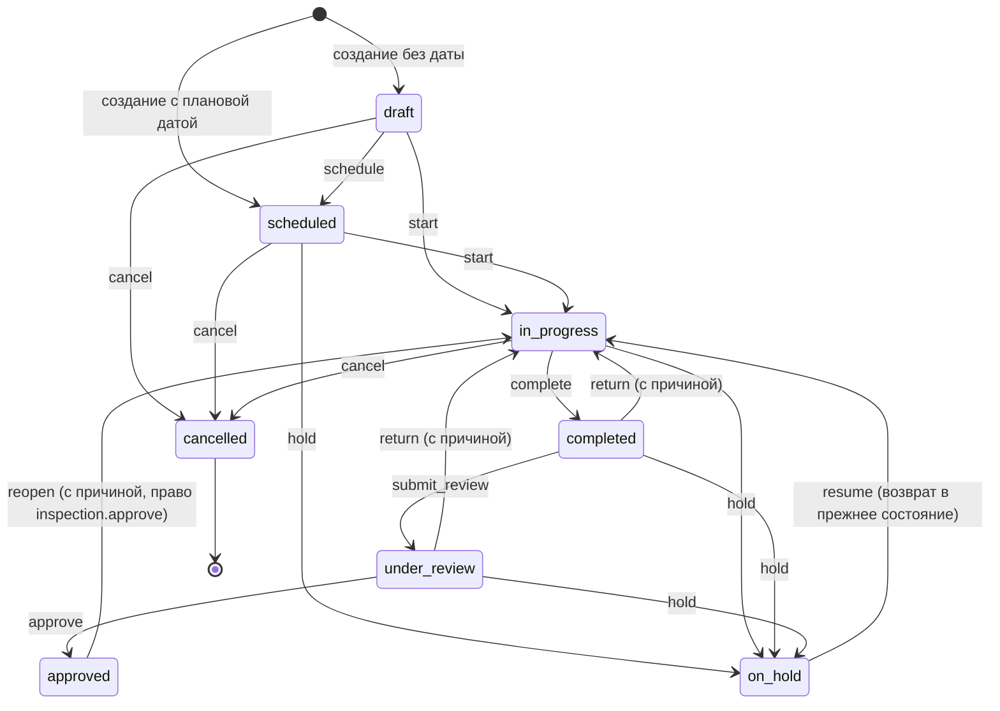

Состояния `READY` нет намеренно: это был бы клик без решения за ним. Инспекция запланирована — и затем начата.

### Действия, права и обязательная причина

| Действие | Из | В | Право | Причина обязательна | Проверки |
|---|---|---|---|---|---|
| `schedule` | draft | scheduled | `inspection.update` | — | есть плановая дата начала |
| `start` | scheduled, draft | in_progress | `inspection.start` | — | исполнитель с областью «свои» должен быть назначен на инспекцию |
| `complete` | in_progress | completed | `inspection.complete` | — | все обязательные пункты чек-листа отвечены |
| `submit_review` | completed | under_review | `inspection.complete` | — | — |
| `return` | under_review, completed | in_progress | `inspection.review` | **да** | причина сохраняется в `review_comment` и видна инспектору |
| `approve` | under_review | approved | `inspection.approve` | — | фиксируются `reviewed_by` и `reviewed_at` |
| `reopen` | approved | in_progress | `inspection.approve` | **да** | единственный выход из утверждённой инспекции |
| `hold` | scheduled, in_progress, completed, under_review | on_hold | `inspection.cancel` | **да** | — |
| `resume` | on_hold | предыдущее состояние | `inspection.cancel` | — | — |
| `cancel` | draft, scheduled, in_progress, on_hold | cancelled | `inspection.cancel` | **да** | — |

Сдать работу — действие самого инспектора (`inspection.complete`), а `inspection.review` — право судить о работе, а не сдавать её.

### Защита от тихого изменения

Редактировать данные инспекции, чек-лист, замечания, замеры и фотографии можно только в `draft`, `scheduled`, `in_progress`. После `complete` экран становится read-only, а попытка записи возвращает 409 с объяснением.

Утверждённую инспекцию изменить нельзя вовсе — только `reopen` с письменной причиной, которая попадает и в историю, и в аудит. Исключение одно: статус замечания (`open → acknowledged → resolved → withdrawn`) меняется и после утверждения — это работа по следам инспекции, а не переписывание самой инспекции. Текст замечания при этом заморожен вместе с остальными доказательствами.

Тот же запрет действует и со стороны заявки: пункт чек-листа, принадлежащий инспекции, подчиняется её блокировке, даже если открыть его через старый эндпоинт заявки.

### Связь с заявкой

Единственная автоматическая связь: первая начатая инспекция переводит назначенную заявку в работу — и только через `JobWorkflowService`, со своей записью в истории заявки. Обратного автоматизма нет: заявка с тремя инспекциями не закончена оттого, что закончена одна из них.

Создание заявки открывает её первую инспекцию — ту, что несёт чек-лист. Остальные добавляются вручную на карточке заявки, вкладка «Инспекции».

### Чек-лист

Пункты — снимок шаблона на момент создания инспекции: подпись, тип поля, секция, обязательность и версия шаблона копируются в строку. Правка шаблона в следующем году не меняет того, что спрашивали в прошлом (ISO 17020). Версия шаблона хранится в `template_version`; строки, снятые до PHASE 4, так и остаются `v1-draft`.

Обязательность (`is_required`) по умолчанию `true` — ровно то, чего и раньше требовал процесс заявки. Шаблон помечает необязательными только те пункты, которых на объекте может не быть вовсе (сертификат калибровки весов при драфт-сюрвее, экспресс-тест влажности).

### Автосохранение в поле

Полевой экран копит правки и отправляет их пачкой одним запросом через 800 мс после последнего действия, а также при уходе со страницы и при сворачивании приложения. Состояние показывается честно: «Сохранение…», «Сохранено», «Не сохранено» с кнопкой повтора. Неудачное сохранение не теряет правки — они остаются в очереди.

Первый ответ или первая фотография по запланированной инспекции начинают её автоматически — инспектор явно на объекте. Переход идёт через тот же движок, поэтому в истории он выглядит как обычный `start` с пометкой `auto`.

### Замечания, замеры, фотографии

- **Замечания** (`inspection_findings`) — то, на что кто-то должен отреагировать: важность `info | minor | major | critical`, статус `open | acknowledged | resolved | withdrawn`. Отмеченные `is_internal` не попадают ни в один документ для клиента.
- **Замеры** (`inspection_measurements`) — одна расширяемая таблица вместо колонки на каждую величину: тип, числовое и/или текстовое значение, единица, место замера.
- **Фотографии** — те же `media_attachments`, что и раньше, с добавленными `inspection_id`, категорией и подписью. Оригинал хранится байт в байт, sha256 позволяет аудитору проверить целостность, GPS и время съёмки приходят с устройства.

### Движок

Как и у заявки: `InspectionWorkflowService.apply()` — единственный, кто пишет `status`, и делает это всегда одинаково:

```
проверить право → проверить допустимость перехода → проверить причину →
проверить бизнес-правила → обновить строку → записать историю →
записать аудит → отправить событие
```

### Архив против отмены

`cancelled` — бизнес-исход, инспекция видна. `deleted_at` — архив, инспекция скрыта из списков и восстанавливается по праву `inspection.restore`. Архивировать можно только инспекцию, которая не начиналась (`draft`, `scheduled`) или уже отменена.

### Конкурентное редактирование

У инспекции есть `version`, увеличиваемая триггером. Форма присылает версию, с которой её открыли; если в базе новее — 409 с понятным сообщением вместо тихой перезаписи чужой правки.

---

## Проба (Sample) и цепочка ответственного хранения

Проба — физический предмет, который уезжает с причала в опломбированном пакете и приезжает на лабораторный стол. Вместе с ним должна приехать бумага, доказывающая, что это тот самый пакет.

Поэтому хранятся **две разные записи**, и это главное архитектурное решение фазы:

- **статус** — то, что бизнес считает о пробе;
- **цепочка ответственного хранения** — где проба физически была и кто её держал.

Проба может трижды сменить руки, не меняя статуса, а «в пути» — это место, где она находится, а не решение, которое кто-то принял. Именно поэтому `in_transit` есть среди событий custody и нет среди статусов.

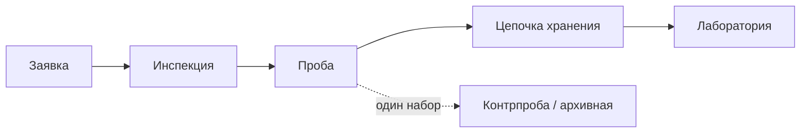

### Состояния

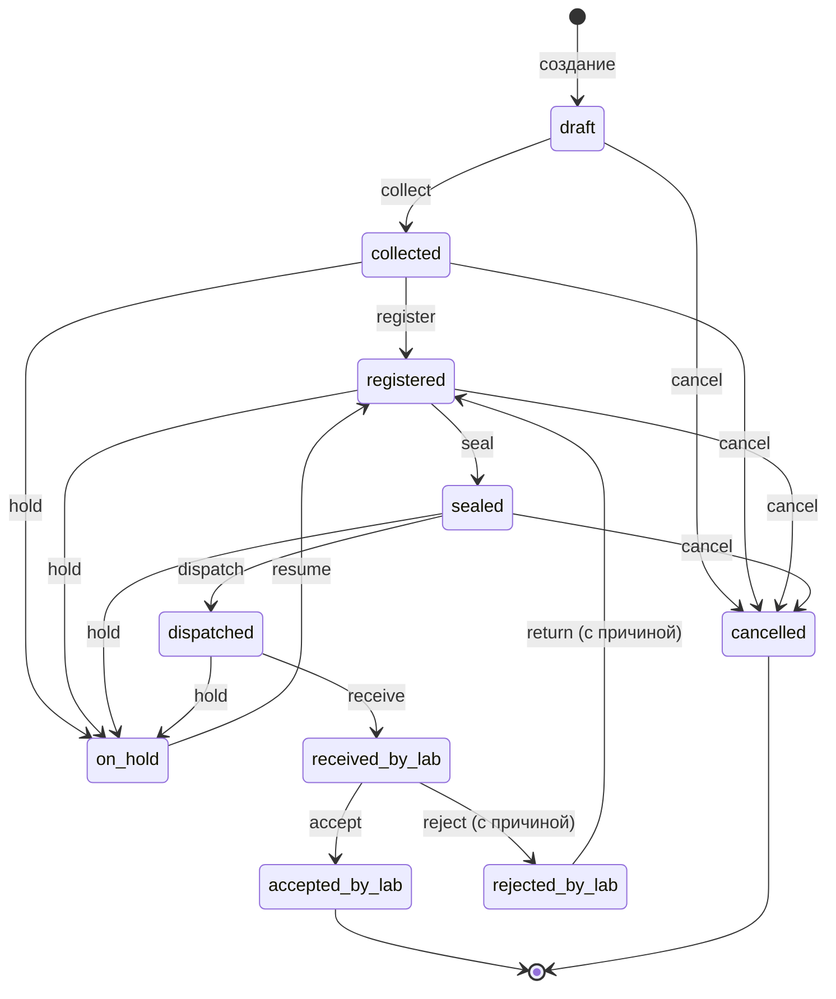

### Действия, права и обязательная причина

| Действие | Из | В | Право | Причина обязательна | Проверки |
|---|---|---|---|---|---|
| `collect` | draft | collected | `sample.create` | — | известно, кто отобрал |
| `register` | collected | registered | `sample.register` | — | культура, количество, единица, кто и когда отобрал |
| `seal` | registered | sealed | `sample.seal` | — | указан номер пломбы |
| `dispatch` | sealed | dispatched | `sample.dispatch` | — | выбрана лаборатория назначения |
| `receive` | dispatched | received_by_lab | `sample.receive` | — | фиксируются состояние пломбы и пробы |
| `accept` | received_by_lab | accepted_by_lab | `sample.accept_lab` | — | — |
| `reject` | received_by_lab | rejected_by_lab | `sample.reject_lab` | **да** | обязательна причина из словаря |
| `return` | rejected_by_lab | registered | `sample.dispatch` | **да** | — |
| `hold` | collected … dispatched | on_hold | `sample.update` | **да** | — |
| `resume` | on_hold | предыдущее состояние | `sample.update` | — | — |
| `cancel` | draft, collected, registered, sealed, on_hold | cancelled | `sample.update` | **да** | — |

Отправить неопломбированную пробу нельзя — именно эту дыру цепочка хранения и существует, чтобы закрыть. Отменить пробу, которая уже уехала, тоже нельзя: она физически не у нас.

### Регистрация замораживает личность пробы

До регистрации проба — форма, которую кто-то начал заполнять. После неё поля «что это за проба» (тип, метод, культура, количество, единица, партия, тара, кто и когда отобрал) менять нельзя: иначе пломба, этикетка и бумаги лаборатории начнут описывать что-то другое. Примечания и инструкции остаются открытыми, пока проба у нас.

### Цепочка хранения: только добавление

`sample_custody_events` — таблица, на которую у роли `gsi_app` есть `SELECT` и `INSERT` и больше ничего. Ни ошибка в коде, ни администратор с браузером не могут переписать запись о передаче задним числом. Эндпоинтов `PATCH` и `DELETE` для события не существует.

Ошибку исправляет **новое событие** `correction`, которое ссылается на исправляемое (`corrects_event_id`). Исходная запись остаётся на таймлайне — зачёркнутой, с исправлением рядом. То, что кто-то изменил свою версию событий, само по себе факт, который стоит сохранить. Исправить одно событие можно один раз.

События custody: `collected`, `registered`, `sealed`, `handover`, `dispatched`, `in_transit`, `received`, `lab_received`, `lab_accepted`, `lab_rejected`, `returned`, `archived`, `correction`.

Переход статуса и событие, которое он означает, пишутся **в одной транзакции**. Проба, у которой статус «отправлена», но в цепочке нет отправки, была бы хуже, чем отсутствие записи вообще.

### Пломбы

На пробе хранятся номер и тип пломбы, кто и когда опломбировал, состояние пломбы, а также когда и кем она была вскрыта. При приёмке лаборатория указывает состояние пломбы: если оно не «цела», время и автор вскрытия проставляются автоматически — нарушенная пломба должна быть зафиксирована, а не забыта.

### Несколько проб и наборы

Одна инспекция может не иметь проб вовсе, иметь одну или иметь много. Пробы одной партии объединяются полем `sample_group` (первичная, контрпроба, архивная), а `parent_sample_id` — задел под деление пробы лабораторией на навески в PHASE 6. Ничего из этого не строится «на вырост» дальше самой связи.

### Граница с лабораторией

Приёмка пробы — это граница между полем и лабораторией: `received_by_lab → accepted_by_lab | rejected_by_lab`. С принятой пробы начинается [анализ](#анализ-test-request-и-результат); на пробе, которую лаборатория не приняла, запросить анализ нельзя.

### Этикетка и QR

Этикетка печатается из карточки пробы: номер, заявка, клиент, культура, тип, количество, пломба, дата, назначение. QR на ней — **ссылка в приложение**, а не публичная страница. QR отчёта доказывает подлинность документа постороннему, и потому публичен; этикетка же приклеена к пакету в порту, и культура, клиент и назначение груза — не дело того, кто её поднял. Скан без сессии приводит на экран входа, а с сессией — к той же Row-Level Security, что и везде.

---

## Анализ (Test Request) и результат

Единица работы лаборатории — **один анализ одной пробы**. Не «лабораторная работа по заявке» и не «протокол»: влажность и содержание белка идут по разным методикам, на разном оборудовании, у разных исполнителей и заканчиваются в разное время, поэтому у каждого свой жизненный цикл.

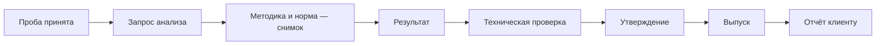

Весь смысл модуля в том, что путь от значения до отчёта проходит через **три разных решения трёх разных людей**: тот, кто измерил, не проверяет; тот, кто проверил, не обязательно утверждает; и утверждённое — ещё не выпущенное.

### Состояния

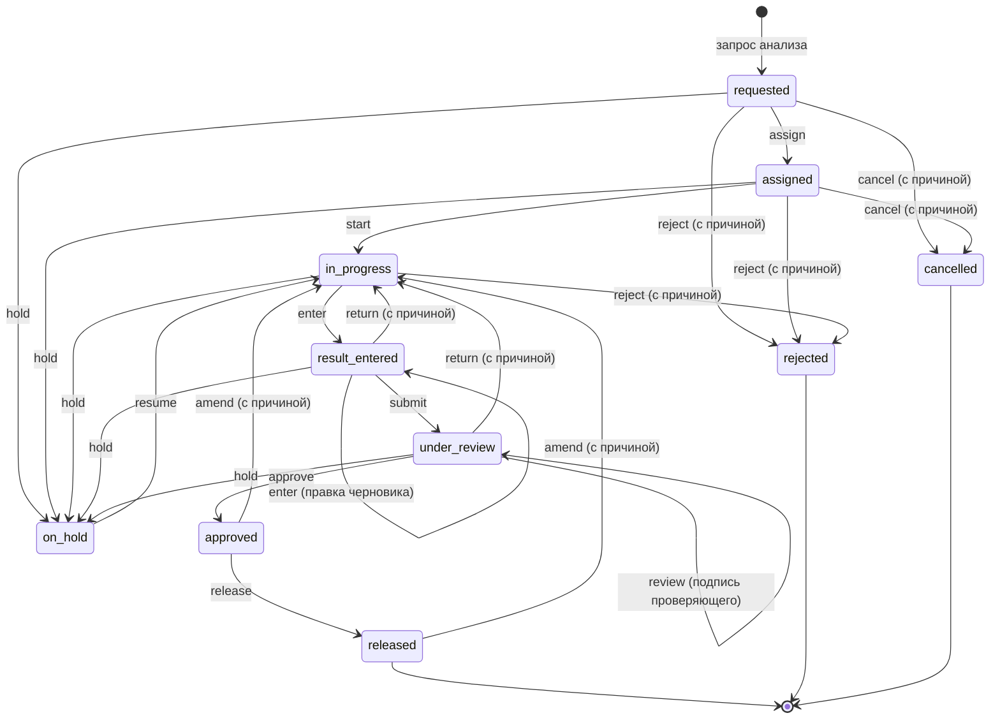

### Действия, права и обязательная причина

| Действие | Из | В | Право | Причина обязательна | Проверки |
|---|---|---|---|---|---|
| `assign` | requested, assigned | assigned | `lab.test.assign` | — | исполнитель активен, имеет право вносить результаты и работает в офисе этой лаборатории |
| `start` | assigned | in_progress | `lab.test.start` | — | начать может назначенный исполнитель (или тот, кто распределяет работу) |
| `enter` | in_progress, result_entered | result_entered | `lab.result.enter` | — | — |
| `submit` | result_entered | under_review | `lab.result.submit` | — | результат есть |
| `review` | under_review | under_review | `lab.result.review` | — | результат есть; проверяющий — **не** исполнитель |
| `return` | under_review, result_entered | in_progress | `lab.result.review` | **да** | — |
| `approve` | under_review | approved | `lab.result.approve` | — | есть результат, есть техническая проверка, утверждающий — **не** исполнитель |
| `release` | approved | released | `lab.result.release` | — | — |
| `amend` | approved, released | in_progress | `lab.result.amend` | **да** | — |
| `hold` | requested … under_review | on_hold | `lab.test.assign` | **да** | — |
| `resume` | on_hold | предыдущее состояние | `lab.test.assign` | — | — |
| `reject` | requested, assigned, in_progress | rejected | `lab.test.assign` | **да** | лаборатория не может выполнить: не та матрица, мало пробы, нет аккредитованной методики |
| `cancel` | requested, assigned, on_hold | cancelled | `lab.test.request` | **да** | нельзя отменить работу, которую уже начали, — она сделана |

`review` намеренно **не двигает статус**: проверка — это подпись на работе, а утверждение — отдельное решение отдельным правом. Без этой подписи `approve` отказывает.

### Разделение ролей: кто не может что

- **Исполнитель не проверяет себя.** `review` и `approve` от того, кто внёс результат, отклоняются (403).
- **Исключение существует и оно именное.** Право `lab.result.self_approve` снимает это ограничение — для маленькой лаборатории, где физически один человек. Оно не входит ни в одну роль по умолчанию, включая администратора: самоутверждение должно быть решением, которое кто-то принял осознанно, а не побочным эффектом сида.
- **После сдачи работы исполнитель не пишет.** В статусах `under_review`, `approved` и `released` `PATCH .../result` отвечает 409.

### Утверждено — ещё не выпущено

`approved` — лаборатория говорит, что число верно. `released` — лаборатория говорит, что его можно показывать наружу. Это разные утверждения: результат бывает правильным и при этом не готовым к выдаче — не оплачен, не собран весь набор, не согласован с клиентом.

`GET /lab/released` — единственный источник лабораторных данных для отчётов, и он показывает только выпущенные ревизии. Утверждённое, но не выпущенное в отчёт не попадёт.

### Исправление: ревизия, а не правка

Утверждённый результат не редактируется. `amend` создаёт **новую ревизию** с обязательной причиной, возвращает анализ на рабочее место и оставляет предыдущую ревизию в точности такой, какой её подписали, — потому что она уже процитирована в отчёте, ушедшем клиенту.

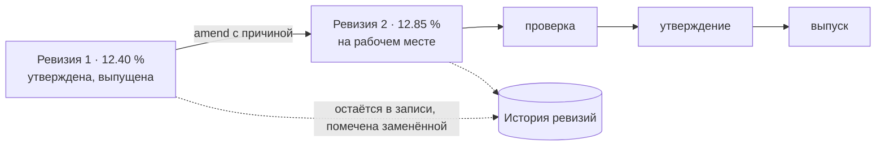

Частичный уникальный индекс не даёт существовать двум действующим ревизиям одного анализа, а `supersedes_result_id` говорит, какая какую заменила.

### Результат вне нормы

Норма находится в момент запроса анализа по правилу «самая частная выигрывает»: контракт → клиент → культура → норма без привязки. Найденная норма копируется в результат, и по ней считается `evaluation`.

Вне нормы — это **сообщение, а не исправление**: значение остаётся ровно таким, каким его измерили, статус получает явную отметку `out_of_spec`, запись попадает в журнал аудита и в отдельный фильтр очереди. Система не подгоняет число, не прячет его и не мешает работе идти дальше — что делать с отклонением, решают клиент и лаборатория, а не программа.

### Точность

Численный результат идёт от формы до колонки `numeric(18,6)` **строкой** и ни разу не проходит через `double precision`: 0.001 и 12345.6789 возвращаются ровно такими, какими их ввели. Колонка хранит точное десятичное значение — но не то, сколько значащих цифр набрал аналитик: 12.40 и 12.4 для неё одно и то же число. Печать результата с той точностью, с какой его измеряли, — задача оформления сертификата, и она относится к PHASE 7.

### Рабочие записи

Распечатка прибора, запись взвешивания, рабочий журнал прикладываются **к ревизии**, а не к анализу: они доказывают именно то значение, рядом с которым лежат. После сдачи результата приложить к нему что-то ещё нельзя — ревизия открывает новую запись со своими документами, а заменённая сохраняет ту распечатку, которую читали, когда её подписывали.

### Лаборатория в другом офисе

Работу видит и офис, которому принадлежит заявка, и офис лаборатории, куда отправлена проба (`app_can_see_branch(branch_id) OR app_sees_laboratory(laboratory_id)`), а исполнителем можно назначить только сотрудника того офиса, где стоит прибор.

Полная карточка пробы принимающему офису не открывается: и проба, и анализ читаются с `JOIN` к заявке и клиенту, а те принадлежат отправляющему офису и закрыты его политикой. PHASE 7 не стала расширять эту политику, а добавила **отдельное представление наименьших привилегий** — `GET /lab/samples/:id/brief` поверх функции `lab_sample_brief(uuid)` (`SECURITY DEFINER`):

| Отдаётся лаборатории | Не отдаётся |
|---|---|
| номер пробы, статус, культура | контракты и их суммы |
| количество и единица | тарифы и цены |
| номер и состояние пломбы | счёта |
| даты отбора и приёмки, тара, партия | адрес клиента и его контакты |
| замечания о состоянии, инструкции | коммерческие заметки CRM |
| номер заявки и **имя клиента** | всё остальное по заявке |

Имя клиента отдаётся сознательно: лаборатория, которая не может сказать, чей материал у неё на столе, не в состоянии вести цепочку ответственного хранения. Кто имеет право на этот ответ, решает база (`app_sees_laboratory` + `lab.test.read`), а не приложение, и отправляющему офису brief не отдаётся вовсе — он читает саму пробу.

**Что осталось решением бизнеса, а не кода.** Принимающий офис по-прежнему не открывает карточку заявки и не доводит межофисную отправку до конца сам. Расширять это значит открывать коммерческие данные клиента другой стране — решение не техническое, поэтому оно вынесено отдельно. Подробности и мотивировка — в [`SECURITY.md`](SECURITY.md).

### Приборы и поверка

Прибор к результату привязывается по желанию. Просроченная поверка — **предупреждение, а не запрет**: отказать в записи уже сделанного измерения значит потерять измерение, а прибор с просроченной поверкой у лаборатории всё равно останется. Вместо этого факт просрочки записывается в результат (`instrument_overdue`) и остаётся там навсегда.

### Стандартный набор культуры

Набор анализов по культуре — это `commodities.lab_methods`, заполненный в справочнике ещё в миграции 004. Отдельной таблицы наборов нет: вторая копия того же списка была бы вторым списком, который надо держать в согласии с первым.

### Движок

`LabWorkflowService` — четвёртый экземпляр той же формы, что `JobWorkflowService`, `InspectionWorkflowService` и `SampleWorkflowService`: право → законность перехода → причина → проверки → строка → история → аудит → событие, всё в транзакции вызывающего. Свободного `PATCH status` не существует.

---

## Документ (Report / Certificate)

Отчёт и сертификат — это то, что уходит из здания с именем клиента на первой странице. Поэтому у документа своя жизнь, отдельная от заявки: его пишут, проверяют, утверждают и выпускают — и после выпуска не правят никогда.

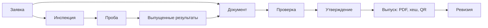

### Состояния

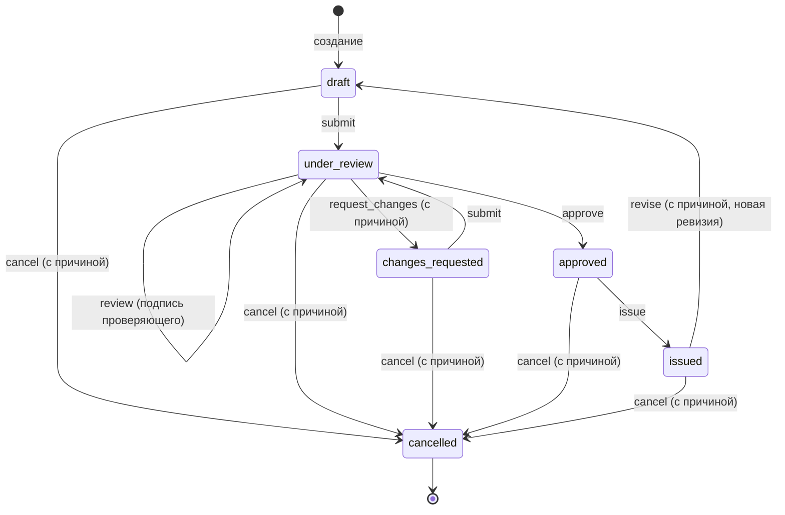

### Действия, права и обязательная причина

| Действие | Из | В | Право | Причина обязательна | Проверки |
|---|---|---|---|---|---|
| `submit` | draft, changes_requested | under_review | `report.submit_review` | — | есть содержимое и форма; прежняя подпись проверяющего снимается |
| `review` | under_review | under_review | `report.review` | — | проверяющий — **не** автор |
| `request_changes` | under_review | changes_requested | `report.review` | **да** | — |
| `approve` | under_review | approved | `report.approve` | — | документ проверен, утверждающий — **не** автор |
| `issue` | approved | issued | `report.issue` | — | факты замораживаются, PDF рендерится, хешируется и сохраняется |
| `revise` | issued | draft | `report.revise` | **да** | выпущенная ревизия остаётся нетронутой |
| `cancel` | любое до отмены | cancelled | `report.cancel` | **да** | документ остаётся в истории |

`review` не двигает статус — это подпись, а утверждение отдельное решение отдельным правом, как и в лаборатории. Пересдача после доработки снимает старую подпись: документ, который изменили, нужно смотреть заново.

### Выпуск замораживает документ

В момент выпуска в `report_versions.data_snapshot` копируются факты: клиент, заявка, инспекции с чек-листом, замечаниями и замерами, пробы, **выпущенные** результаты с методиками, нормами и единицами, подписи. PDF рендерится из этой копии, считается его SHA-256, файл кладётся в объектное хранилище — и больше не перерисовывается никогда. Скачивание через год отдаёт те же байты.

Поэтому переименованный клиент или пересмотренная методика не меняют выпущенный документ: он на них больше не смотрит.

### Только выпущенные результаты

В документ попадают результаты в состоянии `released`, и никакие другие. Внесённый, проверенный и даже утверждённый результат — это ещё не то, что можно показать клиенту. Правило живёт в `ReportDataService`, а не на экране, который мог бы о нём забыть.

### Ревизия: новый документ с тем же номером

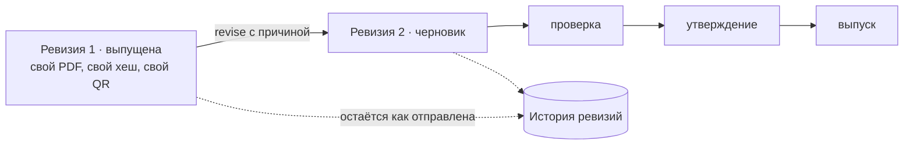

Базовый номер не меняется — `TR-C-2026-00001` остаётся `TR-C-2026-00001`, меняется номер ревизии. Каждая выпущенная ревизия хранит собственный файл, собственную контрольную сумму и собственный QR-код, потому что её печатали и отправляли отдельно.

### Что отвечает QR

Проверка по коду отвечает о той копии, которую человек держит в руках:

| Состояние копии | Ответ |
|---|---|
| действующая ревизия выпущена | подлинный и действующий документ |
| эту ревизию заменила более поздняя | действительный исторический документ, заменён ревизией N |
| документ отменён | отменён, с причиной |
| кода нет в базе | документ не найден |

Отвечать 404 на заменённый или отменённый документ значило бы научить людей не доверять проверке. При этом ответ намеренно тонкий: номер, тип, ревизия, дата выпуска, офис-эмитент и контрольная сумма файла. Имени клиента там нет — кто держит документ, и так его знает, а кто нашёл только QR, не должен узнать его от нас.

### Формы

Шаблон — это список секций и их настроек, а не код: семь типов документов — это семь строк в `report_templates`, а не семь экранов. Версию формы поднимает триггер базы.

Выпуск копирует форму в ревизию целиком — не только номер версии, но и сам список секций (`report_versions.template_definition`). Правка формы поднимает её версию до v2, и с этого момента новый документ печатается по v2, а выпущенный остаётся с v1: и файл его не перерисовывается, и утверждение «напечатан по форме v1» можно проверить в базе, а не только поверить на слово. У 520 исторических ревизий это поле пусто — формы, по которой их печатали, никто не записывал.

### Черновик

Предпросмотр рендерится по требованию, несёт водяной знак и нигде не сохраняется: черновик — ещё не документ. Автор правит только `draft` и `changes_requested`; в остальных состояниях правка отклоняется с 409 и предложением открыть ревизию.

### Документ, который выпускает утверждение заявки

Утверждение заявки по-прежнему выпускает акт инспекции в той же транзакции, и это не дыра в процессе: утверждение заявки **и есть** проверка, сделанная тем, у кого право `job.approve`. Документ проходит через тот же снимок и тот же рендерер, что и все остальные; разница только в том, что за одно решение не просят расписаться дважды.

### Движок

`ReportWorkflowService` — пятый экземпляр той же формы, что у заявки, инспекции, пробы и анализа: право → законность перехода → причина → проверки → строка → история → аудит. Свободного `PATCH status` не существует.

## Счёт

`draft → issued → partially_paid → paid`, плюс `cancelled`. Отмена не удаляет проводки, а сторнирует их. Детали — в `docs/03-finance-dashboard.md`.

С PHASE 8 `amount_paid` и статус двигает не эндпоинт `pay` напрямую, а `PaymentsService`: `pay` теперь лишь создаёт платёж, полностью разнесённый на этот счёт, — тот же результат, та же проводка (`cash.bank`/`ar.trade`), что и до этой фазы.

## Контракт

`draft → active → suspended / expired / terminated`. Статус меняется вручную; срок действия контролируется отдельно (`valid_to`), и экран контрактов показывает истекающие.

## Предложение (Quote)

Коммерческое предложение — не документ вроде отчёта или сертификата: его можно послать заново после правки, и прежняя копия не обязана остаться на записи как отдельная ревизия. Поэтому у него нет версий и снимков — только статус и история переходов, движок той же формы, что у всех остальных сущностей.

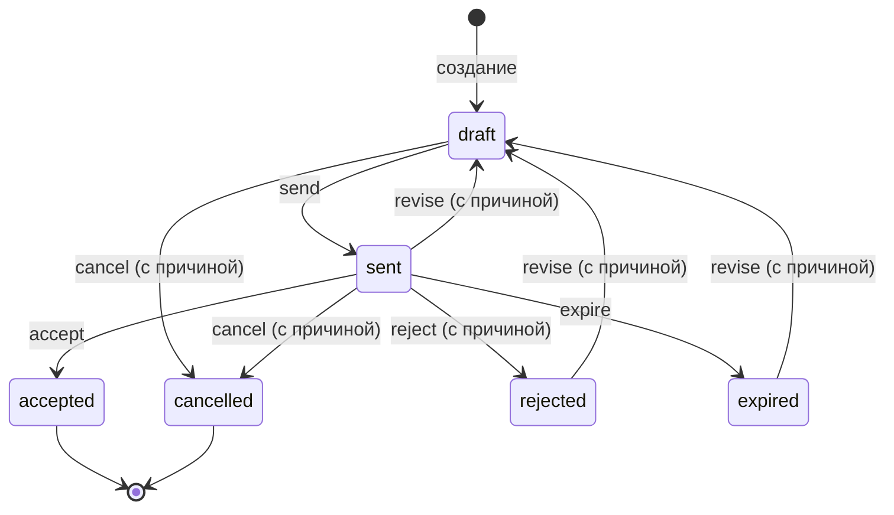

| Действие | Из | В | Право | Причина обязательна |
|---|---|---|---|---|
| `send` | draft | sent | `quote.send` | — |
| `accept` | sent | accepted | `quote.decide` | — |
| `reject` | sent | rejected | `quote.decide` | **да** |
| `expire` | sent | expired | `quote.decide` | — |
| `revise` | sent, rejected, expired | draft | `quote.update` | **да** |
| `cancel` | draft, sent | cancelled | `quote.cancel` | **да** |

`accepted` — не начало ревизий, а конец жизни предложения: принятое предложение превращается в счёт (`POST /finance/quotes/:id/create-invoice`, копирует позиции в новый черновик через тот же `InvoicesService.create`, которым пользуется обычное создание счёта) — дальше живёт счёт, а не предложение.

### Движок

`QuoteWorkflowService` — той же формы, что `JobWorkflowService`, `ReportWorkflowService` и остальные: право → законность перехода → причина → проверки (`hasLines` — у предложения есть хотя бы одна позиция) → строка → история (`quote_status_history`, только на добавление) → аудит.
